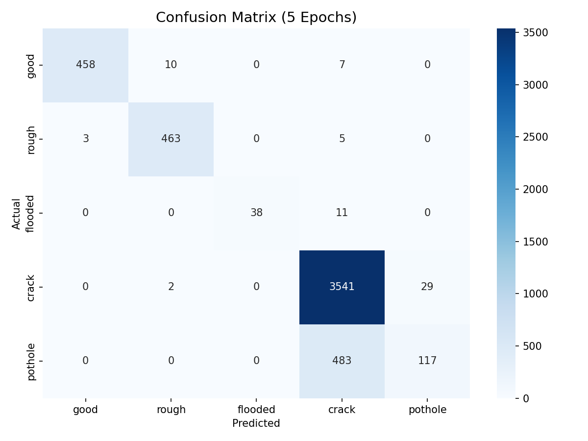
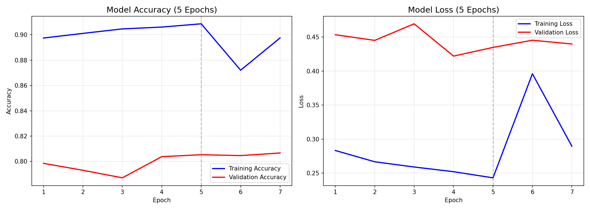
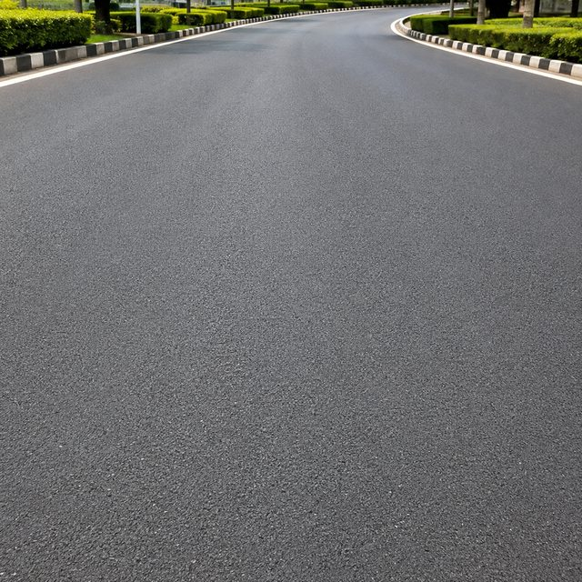
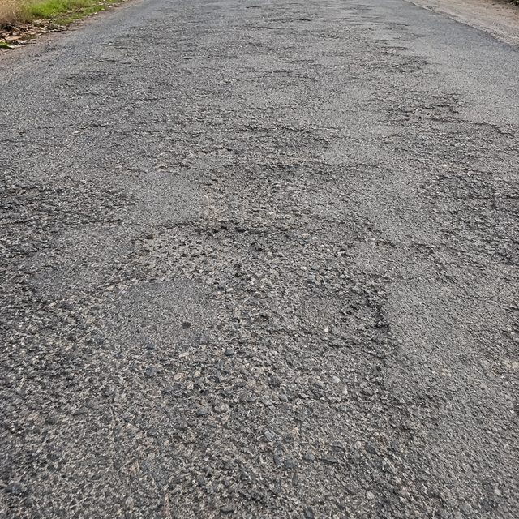
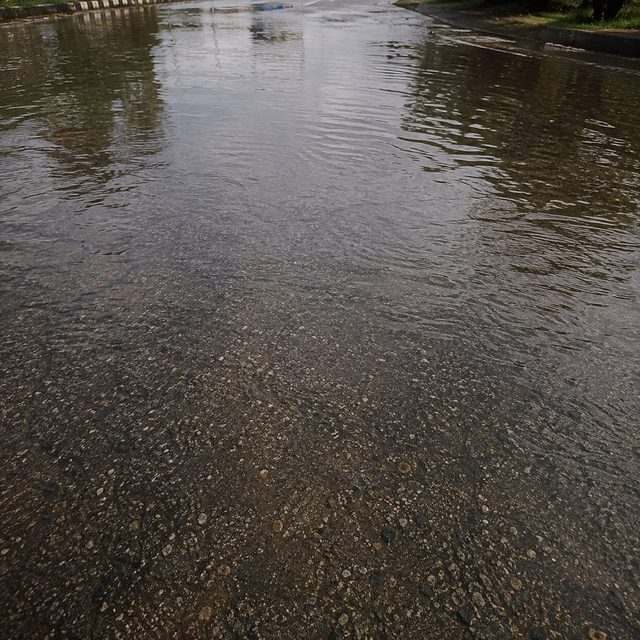
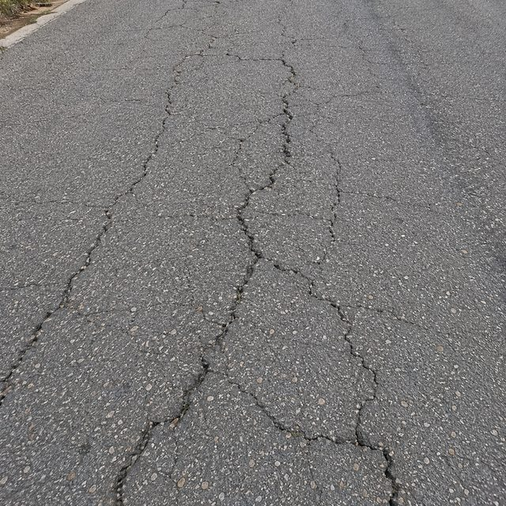
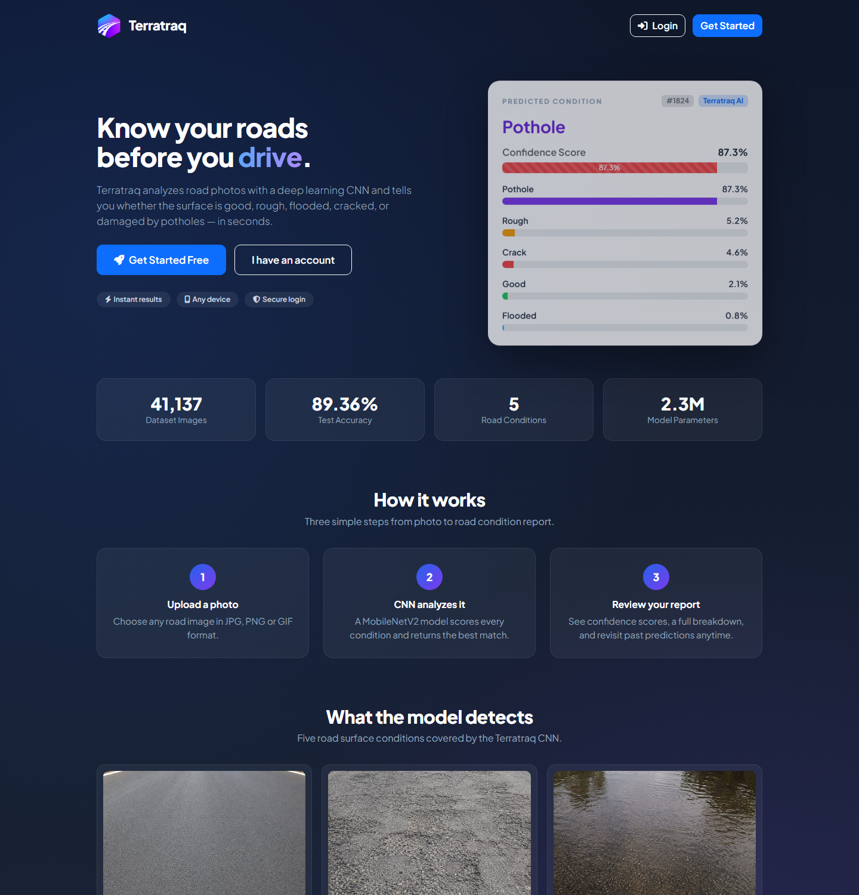
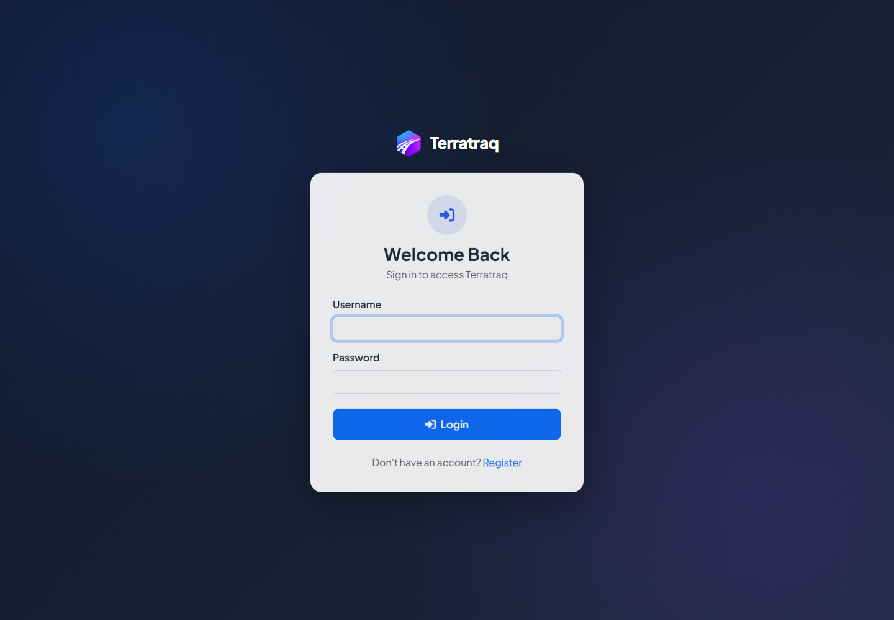
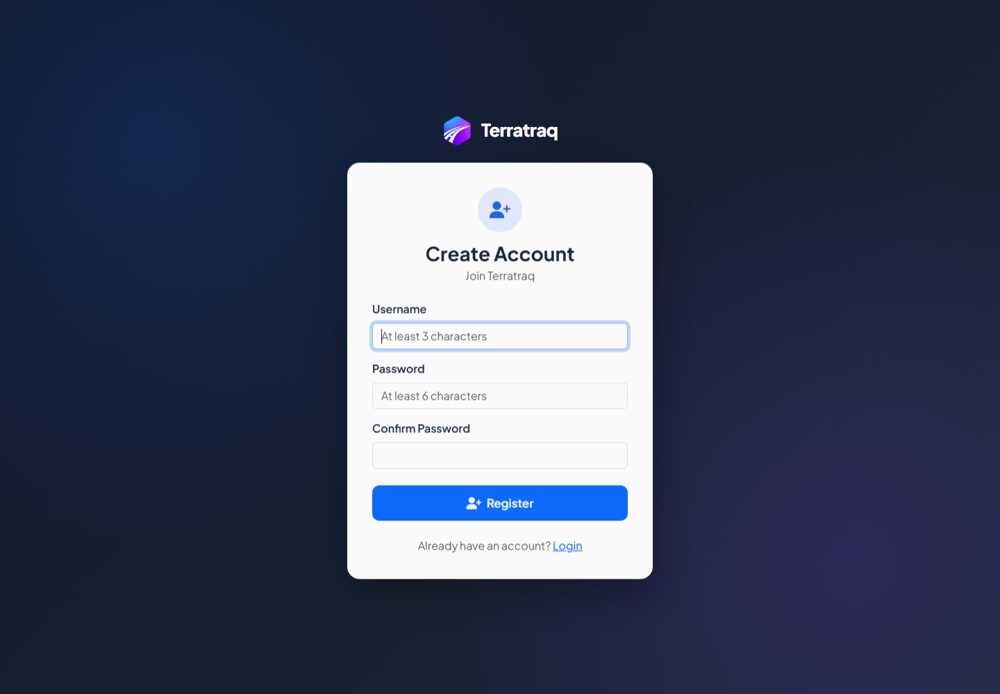

<p align="center">
  
</p>

<h1 align="center">Terratraq</h1>

<p align="center">
  <strong>AI-powered road condition prediction &ndash; know your roads before you drive.</strong>
</p>

<p align="center">
  <a href="https://terratraq.onrender.com"></a>
  
  
  
  
</p>

<p align="center">
  Terratraq is a full-stack web application that classifies road photos with a deep learning
  CNN and tells you whether the surface is <strong>good</strong>, <strong>rough</strong>,
  <strong>flooded</strong>, <strong>cracked</strong>, or damaged by <strong>potholes</strong> &mdash; in seconds.
</p>

---

## Table of Contents

- [Overview](#overview)
- [Key Features](#key-features)
- [Model & Analytics](#model--analytics)
- [Training the Model](#training-the-model)
- [Road Condition Gallery](#road-condition-gallery)
- [Screenshots](#screenshots)
- [Tech Stack](#tech-stack)
- [Project Structure](#project-structure)
- [Getting Started](#getting-started)
- [Environment Variables](#environment-variables)
- [REST API](#rest-api)
- [Admin Panel](#admin-panel)
- [Deployment to Render](#deployment-to-render)
- [Keeping the Service Awake](#keeping-the-service-awake)
- [Roadmap](#roadmap)
- [License](#license)

---

## Overview

Terratraq combines a deep learning CNN (trained with TensorFlow/Keras, served live via
ONNX Runtime) with a polished Flask web app to give anyone a fast, secure way to inspect
road surface condition from a single photo.

Users upload an image, and the model returns:

- The **predicted condition** class (good, rough, flooded, crack, or pothole)
- A **confidence score**
- A **full probability breakdown** across all five classes

Every prediction is stored per-user in **MongoDB Atlas**, viewable in a searchable history,
while an **admin panel** provides user management, system analytics, model health, and retraining tools.

---

## Key Features

| Feature | Details |
|---|---|
| ✓ **5-class road condition CNN** | Good, rough, flooded, crack, pothole &mdash; trained on 41,137 labeled images |
| ✓ **Instant results** | Per-image inference with confidence score + per-class probability bars |
| ✓ **Secure authentication** | Register/login with scrypt-hashed passwords and role-based access |
| ✓ **Per-user history** | Every prediction saved with image, class, and confidence; searchable & filterable |
| ✓ **Admin analytics dashboard** | Total users, predictions, class distribution, upload/model/database sizes |
| ✓ **Admin user management** | Promote, demote, and delete users with last-admin safeguards |
| ✓ **Model management** | Hot-swap restored backups, view training metrics and class distribution |
| ✓ **Model retraining UI** | Upload a new dataset and retrain the CNN from the browser |
| ✓ **REST API** | Programmatic prediction, history, and user endpoints (JSON) |
| ✓ **Keep-alive health endpoint** | Lightweight `/health` check for uptime monitors |
| ✓ **Responsive brand design** | Custom logo, brand system, and a dedicated marketing landing page |

---

## Model & Analytics

The production model is a TensorFlow/Keras CNN trained on an original dataset of **41,137 road images**:

| Split | Images |
|---|---:|
| Train | 30,105 |
| Validation | 5,865 |
| Test | 5,167 |
| **Total** | **41,137** |

<p align="center">
  
  
</p>

---

## Training the Model

Training a CNN needs a GPU and thousands of images, so it runs in **Google Colab**, not on the server. The entire pipeline &mdash; dataset preparation, train/validation/test split, and MobileNetV2 transfer learning &mdash; lives in a single notebook at the repo root:

```text
road_model_training.ipynb
```

**How to retrain and ship a new model**

1. **Get the notebook** &mdash; download it from the live site: login as admin → **System Settings** → *Download training notebook* (or **Model → Update CNN Model** → *Download training notebook* in the "How Training Works" card).
2. **Open in Colab** &mdash; [colab.research.google.com](https://colab.research.google.com) → *File → Upload notebook* → select `road_model_training.ipynb`.
3. **Run it** &mdash; connect to Google Drive when prompted, then run all cells. The notebook downloads the road-condition dataset, splits it, trains, and saves these artifacts to your Drive:
   - `model_final.h5` — Keras CNN weights
   - `class_names.pkl` — class label order
   - `confusion_matrix.png`, `training_history.png` — analytics for the admin panel
4. **Convert to ONNX** &mdash; the live site runs the model with ONNX Runtime (light enough for the free hosting tier), so convert the `.h5` first:
   ```bash
   python tools/convert_to_onnx.py model_final.h5 model_final.onnx
   ```
   (Requires a local Python with TensorFlow/Keras installed; see `tools/convert_to_onnx.py`.)
5. **Upload to the site** &mdash; download `model_final.onnx` and `class_names.pkl` from Drive, then go to **Model → Update CNN Model** on the site and upload them. The model goes live immediately (no restart needed); the old version is kept as a backup.

---

## Road Condition Gallery

These are the five classes the model recognizes, sampled straight from the training data:

<p align="center">
  
  
  
  
  
</p>

<p align="center">
  <em>Good &nbsp;&bull;&nbsp; Rough &nbsp;&bull;&nbsp; Flooded &nbsp;&bull;&nbsp; Crack &nbsp;&bull;&nbsp; Pothole</em>
</p>

---

## Screenshots

<p align="center">
  
</p>

<p align="center">
  <em>Marketing landing page &mdash; hero, live-style prediction mock, and condition showcase</em>
</p>

<p align="center">
  
  
</p>

<p align="center">
  <em>Authentication screens &mdash; clean, branded auth shell</em>
</p>

---

## Tech Stack

| Layer | Technology |
|---|---|
| **Backend** | Python, Flask 2.3, Gunicorn |
| **Machine Learning** | ONNX Runtime 1.28, NumPy (model trained with TensorFlow/Keras, served as ONNX) |
| **Database** | MongoDB Atlas (via PyMongo 4.17) |
| **Frontend** | HTML, CSS, JavaScript, Bootstrap 5, Font Awesome |
| **Image Processing** | Pillow |
| **Hosting** | Render (Python 3.11) |

---

## Project Structure

```text
roadprediction/
├── app.py                        # Flask application (routes, models, admin, API)
├── requirements.txt              # Python dependencies
├── .python-version               # Pins Python 3.11.9 for Render
├── .env.example                  # Environment variable template (see below)
├── road_model_training.ipynb   # Google Colab training notebook (downloadable in admin)
├── tools/
│   └── convert_to_onnx.py      # Converts a trained .h5 model to .onnx for upload
├── model/
│   ├── model_final.onnx        # Trained CNN (ONNX Runtime format, used live)
│   ├── class_names.pkl           # Class label order
│   ├── confusion_matrix.png      # Model analytics
│   ├── training_history.png      # Training curves
│   └── backups/                  # Auto-created model backups (kept out of git)
├── static/
│   ├── css/style.css             # Brand design system + all page styles
│   ├── js/script.js              # Loader, autosubmit, filter interactions
│   ├── images/logo.png           # Brand logo (also used as favicon)
│   └── images/conditions/        # Condition sample images
├── templates/
│   ├── landing.html              # Marketing landing page
│   ├── base.html                 # Authenticated app shell
│   ├── dashboard.html            # User dashboard
│   ├── upload.html / result.html # Upload & prediction result
│   ├── history.html              # Prediction history
│   ├── login.html / register.html
│   └── admin/                    # Admin dashboard, users, model, retrain, settings
└── screenshots/                  # README screenshots
```

---

## Getting Started

### Prerequisites

- Python **3.11** (pinned via `.python-version`)
- A running MongoDB instance **or** a MongoDB Atlas connection string

### 1. Clone & set up

```bash
git clone https://github.com/Buzz-brain/terratraq.git
cd terratraq

python -m venv .venv
# Windows
.venv\Scripts\activate
# macOS / Linux
source .venv/bin/activate

pip install -r requirements.txt
```

### 2. Configure environment

Create a `.env` file in the project root:

```env
SECRET_KEY=change-me-to-a-long-random-string
ADMIN_USERNAME=admin
ADMIN_PASSWORD=your-strong-admin-password
MONGO_URI=mongodb+srv://<dbUser>:<dbPassword>@cluster0.xxxxx.mongodb.net/?retryWrites=true&w=majority
MONGO_DB_NAME=terratraq
```

> The app falls back to a local MongoDB at `mongodb://localhost:27017` if `MONGO_URI` is not set.

### 3. Run

```bash
python app.py
```

Then open **http://localhost:5000**. On first boot the app:

- Connects to MongoDB and creates the `users` / `predictions` collections with proper indexes
- Seeds the default **admin** account (from `ADMIN_USERNAME` / `ADMIN_PASSWORD`)
- Loads the trained CNN model and class names

---

## Environment Variables

| Variable | Required | Default | Description |
|---|---|---|---|
| `SECRET_KEY` | Yes | `change-me-in-production` | Flask session signing key. Use a long random string. |
| `MONGO_URI` | No* | `mongodb://localhost:27017` | MongoDB / Atlas connection string. |
| `MONGO_DB_NAME` | No | `terratraq` | Database name to use. |
| `ADMIN_USERNAME` | No | `admin` | Username for the seeded admin account (used once, on first boot). |
| `ADMIN_PASSWORD` | No | `admin123` | Password for the seeded admin account (used once, on first boot). |

\* Required for production &mdash; point `MONGO_URI` at your Atlas cluster.

> **Note:** The admin is seeded only when no admin exists in the database. After first boot,
> the database is the source of truth &mdash; changing `ADMIN_PASSWORD` later will not overwrite it.

---

## REST API

### `POST /api/predict`

Classify a road image. Requires login.

- **Body:** multipart form field `image` (JPG, PNG, or GIF)
- **Response:**

```json
{
  "prediction": "Pothole",
  "confidence": "87.30%",
  "confidence_value": 87.3,
  "probabilities": [87.3, 5.2, 3.1, 2.8, 1.6],
  "class_names": ["good", "rough", "flooded", "crack", "pothole"]
}
```

### `GET /api/history`

Return the current user&rsquo;s prediction history (all predictions for admins), newest first. Requires login.

### `GET /api/users`

Return all users. **Admin only.**

### `GET /health`

Lightweight health check for uptime monitors / keep-alive cron jobs.

- **200:** `{"status": "ok", "database": true}`
- **503:** MongoDB unreachable

---

## Admin Panel

The admin panel is available at `/admin` after logging in as an admin:

| Section | Purpose |
|---|---|
| **Dashboard** | System stats: users, predictions, class distribution, model/upload/database sizes |
| **Users** | Promote, demote, and delete user accounts (with last-admin safeguards) |
| **Model** | View class distribution, confusion matrix, training history; hot-swap a restored backup |
| **Retrain** | Upload a dataset and retrain the CNN from the browser |
| **Settings** | System information, environment, model file details |

---

## Deployment to Render

1. Push this repository to GitHub.
2. On **Render** create a new **Web Service** and connect the repo.
3. Configure:

| Setting | Value |
|---|---|
| Runtime | Python 3 |
| Build command | `pip install -r requirements.txt` |
| Start command | `gunicorn app:app` (Procfile adds `--timeout 120 --workers 1`) |
| Instance type | Free |

4. Add the environment variables from [Environment Variables](#environment-variables) above
   (same values as your local `.env`).
5. Deploy. The build takes a few minutes (the app no longer installs TensorFlow &mdash;
   it runs the model with the lightweight ONNX Runtime).

> The `Procfile` in the repo sets the gunicorn timeout to 120s (TensorFlow-era default of 30s
> was too short for inference) and pins a single worker to stay inside the free instance's RAM.

---

## Keeping the Service Awake

Render free-tier web services sleep after ~15 minutes without traffic. Any scheduler that
hits the `/health` endpoint every few minutes keeps the instance warm. For example, a free
[cron-job.org](https://cron-job.org) job pinging `https://terratraq.onrender.com/health`
every 10 minutes.

---

## Roadmap

- Persist uploaded images to cloud object storage (Render Disks / S3) so they survive redeploys
- Add an in-app admin password-change form (no DB edits required)
- Add per-user storage quotas and prediction rate limits
- Expand the model to additional surface conditions (gravel, snow, and so on)

---

## License

This project is provided for demonstration and educational purposes. Please contact the author
before using it commercially.
